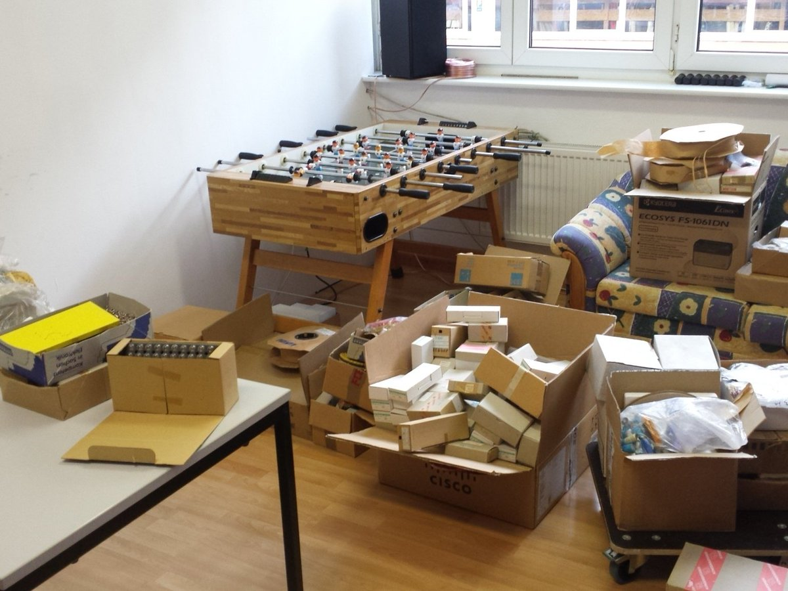
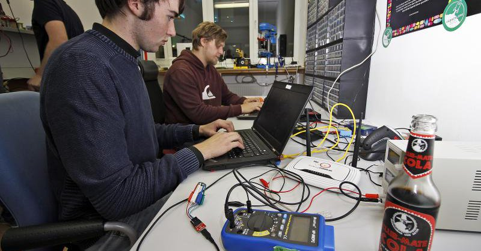
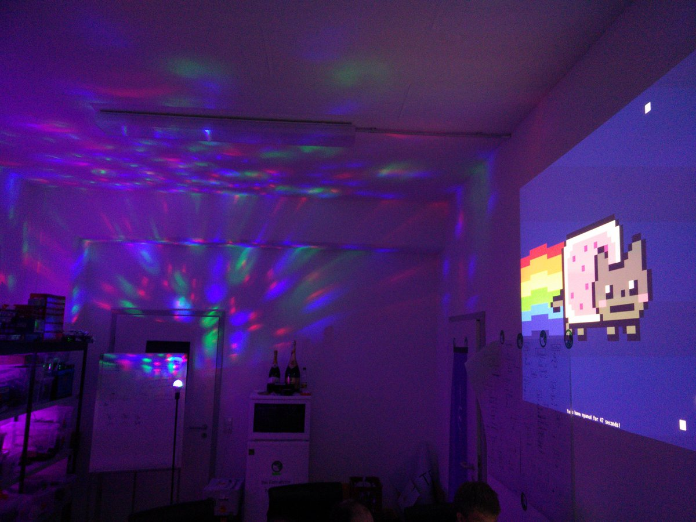
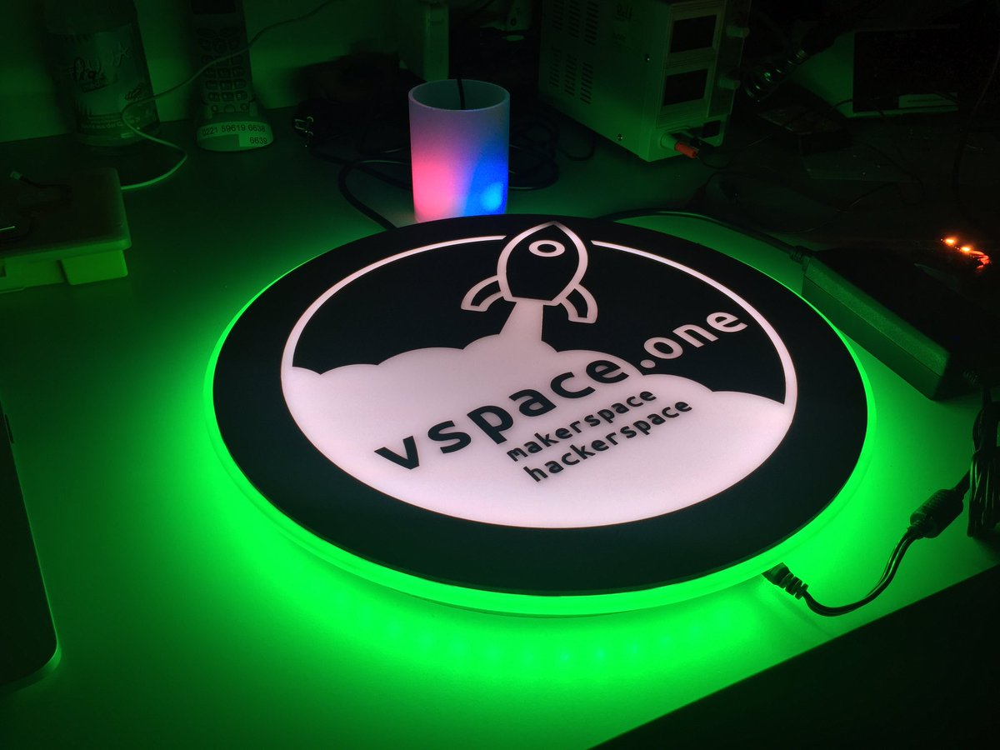
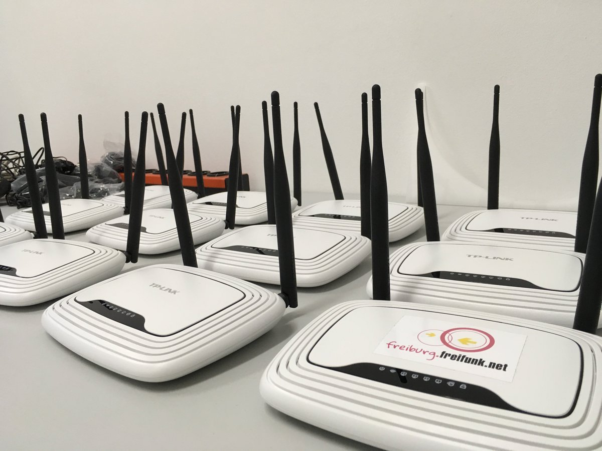
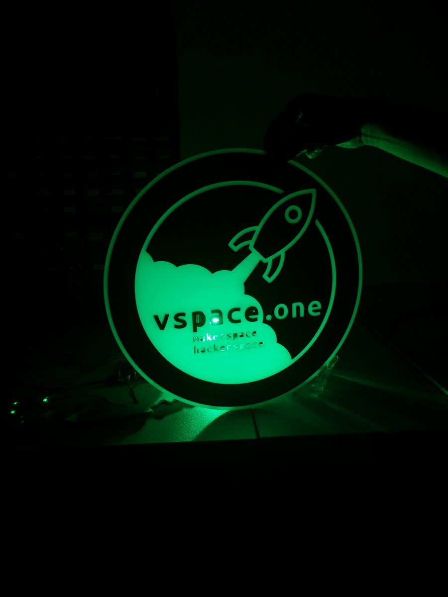
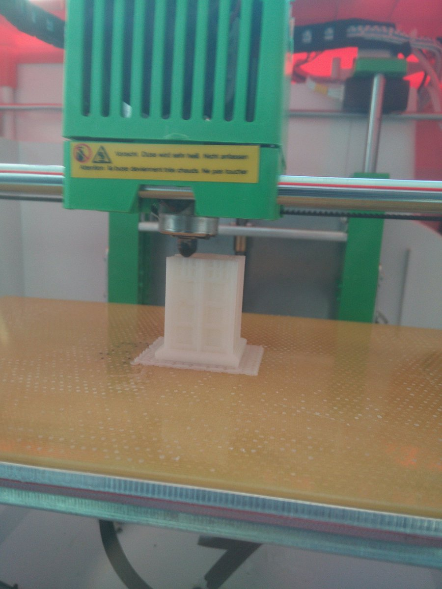
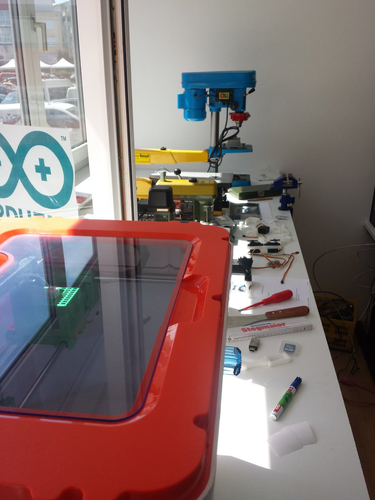
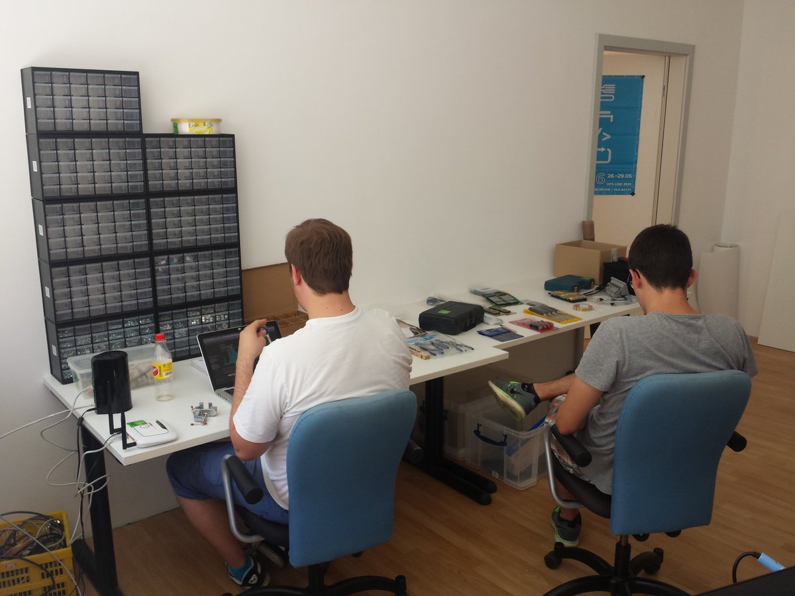
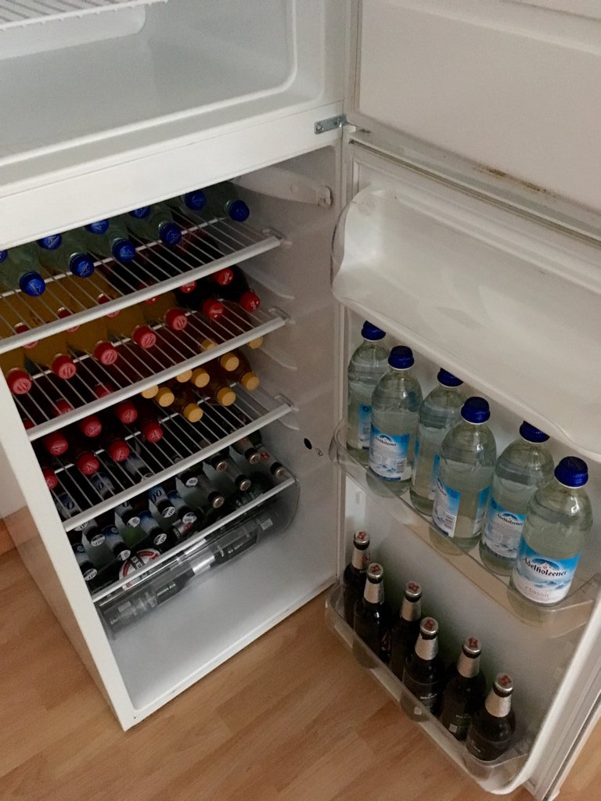

% Jahresbericht 2016
%
% Maximilian Noppel, Alexander Votteler, Damian Jesionek

# Einleitung
Diese Jahr war unser erstes und damit vermutlich erstmal auch ereignisreichstes. Im Mai ging alles los. Zu acht haben wir uns im Schlössle in Villingen getroffen und erstmal über die Idee gesponnen. Zwar sind von damals nichtmehr alle acht dabei aber der Kern der Gründungsmitglieder war schon dabei. Vor uns lagen damals noch unglaublich viele Herausforderungen. Wir hatten keine Raum, kein Plan wie man einen Verein gründet und so einen Hackerspace betreibt. Dennoch haben wir uns gegenseitig motiviert und von der Idee antreiben lassen. Um uns ein Bild davon zu machen was auf uns zukommt haben wir am 24. Mai einen Besuch im Shack in Stuttgart gemacht. Der dortige Hackerspace ist zwar deutlich größer als das was wir geplant hatten aber dennoch sind viele Erinnerungen geblieben und in unseren "Space" getragen worden. Nach einer 1,5 stündiger Führung dort entstand auch unser Name; "vspace.one", in der Lounge im Space. Da die Domain "vspace.de" und ähnliche nicht mehr verfügbar waren musste eben eine Alternative her. Dass die auch gleich in den Namen übergeht war dann eher Zufall. Ideen und die Vision war also klar.

Der erste offizielle Schritt sollte die Vereinsgründung sein. Damit haben wir dann die juristischen Stellung gemeinsam einen Mietvertrag zu unterschreiben. Außerdem ist der erste Schritt dann schonmal getan. Mit anfangs noch sehr hoch angesetzten Mitgliedsbeiträgen, die zum Sichern der Miete gedacht waren, sind wir gestartet. Dass wir eine Woche später mit Ralf Gropengießers TechBoxx Projekt zusammentreffen würden, wäre uns damals noch nicht in den Sinn gekommen. Ein Glückstreffer war es dennoch. Dass zur selben Zeit in der selben Stadt die selbe Initiative startet ist schon verrückt. Das zeigt auch, wie überfällig das für Villingen war. Zweimal das Selbe zu starten hätte natürlich keinen Sinn gemacht, daher haben wir uns kurzerhand zusammengeschlossen. Und schon ein oder zwei Wochen später konnten wir die Räume beziehen. Zwei sind es gleich geworden! Die Mitgliedsbeträge konnten damit direkt wieder gesenkt werden. 

Inzwischen ist schon das ein oder andere Mitglied dazugekommen. Auch können für jedes Mitglied Schlüssel rausgeben. Wir haben ein schönes Wiki, eine funktionierend Mailingliste und starke Maschinen. Tolle Projekte und Menschen beleben den Space zu ca. 11% der Zeit. Auf 24/7 gerechnet!

Ich denke wir können stolz sein auf das was wir im Jahr 2016 auf die Beine gestellt haben. Ich bin es.

Hackige Grüße,
Max

P.S.: Das mit dem Konto bekommen wir auch noch hin... :D

# Tätigkeiten
## 1. Robocode Battlenight
Eines der ersten gemeinsamen Events war die erste Robocode Battlenight am 16. September. Robocode ist eine Javaumgebung in der Bots in Form von Panzern simuliert werden. Allerdings werden die Bots nicht von Menschen gesteuert sondern von Computerprogrammen. Diese galt es zu programmieren. Über eine Java API konnten Funktionen und Events abgefragt und mit Leben gefüllt werden. So wurde aus einem Bot der einfach nur dasteht eine Bot der sich bewegt und gegen anderen kämpft. Zu fünft haben wir uns also um ca. 19 Uhr getroffen und nach eine kurzen Einführung begonnen Taktiken und Strategien zu entwickeln. Gegen Beispielroboter konnte man sein Programm testen. Tatsächlich waren auch Leute dabei, die zum ersten mal programmiert haben. Denen wurde also zuerst noch erklärt wie Bedingungen, Variablen, Schleifen und so weiter zu verwenden sind. Sie haben also nebenbei an einem anschaulichen Spiel die Grundlagen des programmierens gelernt. Gegen 24 Uhr haben wir dann alle 5 Bots auf einander losgelassen und siehe da; Der am Anfang des Abends noch keinen Zeile Code geschrieben hatte, hat tatsächlich den besten Bot gebaut!

Natürlich wurden dann noch verschiedene andere Szenarien durchgespielt, wie 1:1 und eine größere Karte. Da sah das Ergebnis dann wieder ganz anders aus. Einige Bots sind beispielsweise einfach garnicht gefahren, wenn sie niemanden gesehen haben. Das wird von der Engine mit dem plötzlichen Tot bestraft. Auf der kleinen Karte hatte das natürlich keine Rolle gespielt. Auch wurden die Strategien der jeweiligen Bots erkennbar.

Insgesamt also ein sehr spaßiger und lehrreicher Abend.

## 1. Lötworkshop
Am 10.Dezember haben wir unseren ersten Lötworkshop mit Kindern und Jugendlichen durchgeführt. Wir haben von Hackerspace Stuttgart (Shack) 20 Blinkenrockt-Lötbausätze zur Arbeit mit Kindern und Jugendlich erhalten. Über mehrere Zeitungsartikel im Herbst 2016 haben für den ersten Lötworkshop geworben. Dieser wurden dann schließlich kostenlos für 3 Kinder durchgeführt. Gemeinsam haben wir 3 Stunden mit dem erklären von Elektronik, Löttechnik und unserer Tätigkeit verbracht. Getränke und Knabbersachen wurden uns zur Verfügung gestellt. Das Feedback war super, auch von den Eltern. "Das es sowas endlich in Villingen gibt, [...]" war ein Ausdruck. Alle drei Jugendlichen wollen gerne wieder kommen und haben genau wie eine Mutter schon nach weiteren Workshops und Bastelprojekten für zuhause gefragt. Der erste Workshop verlief also erfolgreich.

## Bauteilspende aus Furtwangen
Im Winter kam dann über Tim noch ein weiteres erfreuliches Ereigniss in unseren Space-Alltag. Die Hochschule Furtwangen hat drei Schränke mit Bauteilen aussortiert. Und uns zur Verfügung gestellt. Der rote Toyota Yaris war bis unter das Dach vollgestopft mit Kartons und Rollen von elektronischen Bauteilen. Eine Herausforderung für uns alle die noch immer andauert, das alles zu sortieren. In diesem Rahmen haben wir auch unseren Bauteile-"Shop" in Betrieb genommen.

# Projekte
Im vergangenen Jahr wurden viele Projekt im vspace umgesetzt. Wir möchten hier nur einige kurz anreißen.

## luxbox
Das wohl erste Projekt dieses Jahr war wohl das Logo von Michael und die dazugehörige Lichtsteuerung. Das Logo macht echt was her. Die Hardware ist dabei absolut up-to-date nach aktuellen Ansprüchen. Verwendet wurde eine ESP und die WS2812er LED Strips. Der Server läuft auf einem kleinen NanoPi auf unserer Serverbank. Die ersten Integrationsprojekt in das Luxbox System sind auch bereits gestartet.

## SpaceAPI
Eines der ersten Projekte eines Hackerspaces ist in der Regel der Türstatus und damit die SpaceAPI. Durch diese wird der Öffnungsstatus der Räume öffentlich verbreitet über ein standardisiertes Format anderen bereitgestellt. Diese wurde mit Java implementiert und auf unserem Webserver deployed. Dies Steuerung geschieht über Telnet oder einem Schalter im Space. Auch die Temperatur und Luftfeuchtigkeit wird jetzt schon über die SpaceAPI bereitgestellt.

## Bauteileshop
Im Rahmen den Bauteilespende der Hochschule Furtwangen haben wir eine WooCommerce-Seite eingerichtet die zur Verwaltung der Bauteile dient. Die Katalogisierung ist aber noch in vollem Gange.

# Anschaffungen
## CNC Fräse von Michael
Michael hat sich eine ziemlich coole CNC Fräse gekauft. Mit der sind wir fleißig am fräsen. Beispielsweise einen Staubabsaugung für eben diese Fräse oder einen Stand für unseren kleinen VirtualisierungHost im Space

# Zahlen
Aktuell haben wir 11 Vereinsmitglieder.

Auf der Mailingliste "Public" sind 34 Emailadressen registriert die an Diskussionen und Infos teilhaben.

Wir hatten ca. 11% von 24 Stunden üer 7 Tage geöffnet. Das ist wirklich bemerkenswert.

2016 wurden 2 Zeitungsartikel und 1 Video über uns publiziert.

Wir wurden im Logbuch Netzpolitik Podcast erwähnt. Allerdings wurde Villingen als Willingen ausgesprochen.

Auf Twitter haben wir 35 Follower, 11 Likes und 32 Tweets.

# Danksagungen
## Getränkewart Kai
Ich möchte mich im Namen von uns allen bei Kai Sickeler bedanken, der im vergangenen Jahr fleißig auf unseren Kühlschrank geachtet hat. Das war weiß Gott nicht immer eine leichte Aufgabe bei unserem Getränkekonsum. Vielen Dank dafür.

## Vorstand Alex
Auch wenn er in letzter Zeit nicht mehr so oft im Space anzutreffen war, weil es inzwischen in Ilmenau studiert, hat er uns doch alle mit seiner Faszination angesteckt. Was war anfangs besonders wichtig, ist es aber auch immer noch. Wir verstehen alle, dass es wenig Sinn macht Vorstand eines Vereines in 400km Entfernung zu sein. Deshalb wird er seine Tätigkeit als Vorstand vorerst niederlegen. Danke ihm dennoch  herzlich für seinen Einsatz im vergangenen Jahr. Vielen Dank.

# Fotos

{#id .class width=11cm}

{#id .class width=11cm}

{#id .class width=11cm}

{#id .class width=11cm}

{#id .class width=11cm}

{#id .class width=11cm}

{#id .class width=11cm}

{#id .class width=11cm}

{#id .class width=11cm}

{#id .class width=11cm}

{#id .class width=11cm}

